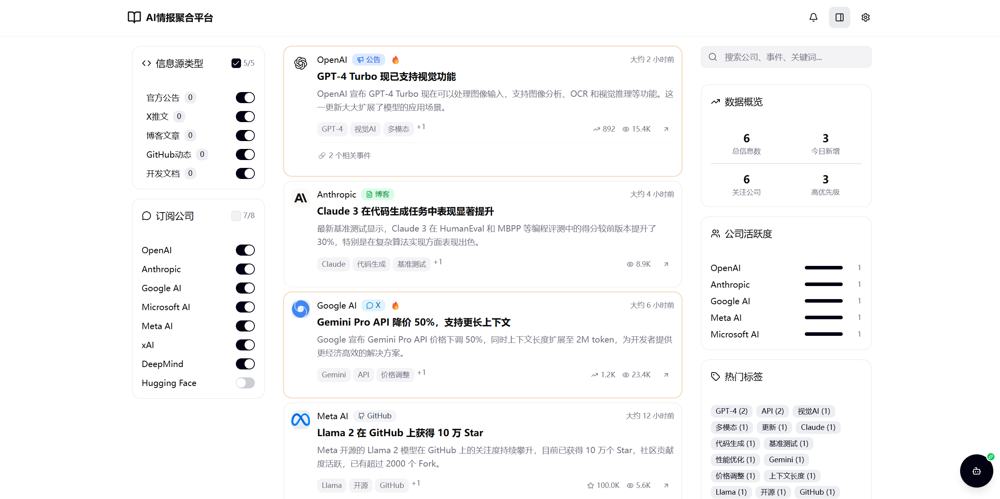

# AIConnect - AI情报聚合平台

<div align="center">
  
  
  <p>一个现代化的AI情报聚合平台，帮助您实时追踪AI领域的最新动态</p>
  
  [](https://github.com/heihuzicity-tech/AIConnect/stargazers)
  [](https://github.com/heihuzicity-tech/AIConnect/network)
  [](https://github.com/heihuzicity-tech/AIConnect/issues)
  [](LICENSE)
</div>

## ✨ 功能特性

- 🔄 **多源聚合** - 整合官方公告、X推文、博客文章、GitHub动态等多种信息源
- 🏢 **公司追踪** - 支持订阅OpenAI、Anthropic、Google AI、Microsoft等知名AI公司
- 🔍 **智能过滤** - 按公司、源类型、时间范围、标签等多维度筛选信息
- 📱 **响应式设计** - 完美适配桌面端和移动端设备
- 🤖 **AI助手** - 内置智能对话助手，帮助分析和理解AI动态
- ⚡ **实时更新** - 自动收集和更新最新信息，保持数据时效性
- 🎨 **现代UI** - 基于Radix UI构建的精美界面，支持暗色模式

## 🚀 快速开始

### 环境要求

- Node.js 18+ 
- npm 或 yarn 包管理器

### 安装依赖

```bash
# 克隆项目
git clone https://github.com/heihuzicity-tech/AIConnect.git
cd AIConnect

# 安装依赖
npm install
```

### 启动开发服务器

```bash
npm run dev
```

访问 `http://localhost:3000` 即可查看应用。

### 构建生产版本

```bash
npm run build
```

## 🏗️ 技术架构

### 前端技术栈

- **React 18** - 现代化React框架
- **TypeScript** - 类型安全的JavaScript
- **Vite** - 快速的构建工具
- **Radix UI** - 无障碍的组件库
- **Tailwind CSS** - 实用优先的CSS框架
- **Lucide React** - 精美的图标库

### 后端服务

- **Supabase** - 开源的Firebase替代方案
- **Edge Functions** - 服务端数据收集和处理
- **实时数据库** - 存储和同步信息数据

## 📋 项目结构

```
src/
├── components/          # React组件
│   ├── ui/             # 基础UI组件
│   ├── Header.tsx      # 头部导航
│   ├── SourcesSidebar.tsx  # 左侧边栏
│   ├── FeedTimeline.tsx    # 信息流
│   ├── ArticleReader.tsx   # 文章阅读器
│   ├── AIAssistant.tsx     # AI助手
│   └── ...
├── supabase/           # 后端函数
│   └── functions/      # Edge Functions
├── utils/              # 工具函数
├── styles/             # 样式文件
├── App.tsx             # 主应用组件
└── main.tsx            # 应用入口
```

## 🔧 配置说明

### Supabase配置

1. 在[Supabase](https://supabase.com)创建新项目
2. 在 `src/utils/supabase/info.tsx` 中配置项目信息：

```typescript
export const projectId = 'your-project-id'
export const publicAnonKey = 'your-anon-key'
```

### 数据收集器配置

项目支持以下数据源的自动收集：
- RSS订阅源
- GitHub仓库动态
- Twitter/X API（需要API密钥）

## 🤝 贡献指南

我们欢迎所有形式的贡献！请遵循以下步骤：

1. Fork 本仓库
2. 创建特性分支 (`git checkout -b feature/AmazingFeature`)
3. 提交更改 (`git commit -m 'Add some AmazingFeature'`)
4. 推送到分支 (`git push origin feature/AmazingFeature`)
5. 开启 Pull Request

### 开发规范

- 使用TypeScript进行类型检查
- 遵循React最佳实践
- 保持代码风格一致性
- 为新功能添加适当的注释

## 📝 许可证

本项目采用 MIT 许可证。查看 [LICENSE](LICENSE) 文件了解更多信息。

## 🙏 致谢

- [React](https://reactjs.org/) - 强大的前端框架
- [Radix UI](https://www.radix-ui.com/) - 优秀的组件库
- [Supabase](https://supabase.com/) - 开源的后端即服务
- [Vite](https://vitejs.dev/) - 快速的构建工具

## 📞 联系我们

- 🌐 **作者博客**: [https://www.heihuzicity.com/](https://www.heihuzicity.com/)
- 📧 **问题反馈**: [GitHub Issues](https://github.com/heihuzicity-tech/AIConnect/issues)
- 💬 **讨论交流**: [GitHub Discussions](https://github.com/heihuzicity-tech/AIConnect/discussions)

---

<div align="center">
  <p>由 <a href="https://www.heihuzicity.com/">黑胡子博客</a> 开发维护</p>
  <p>如果这个项目对您有帮助，请给我们一个 ⭐️</p>
</div>